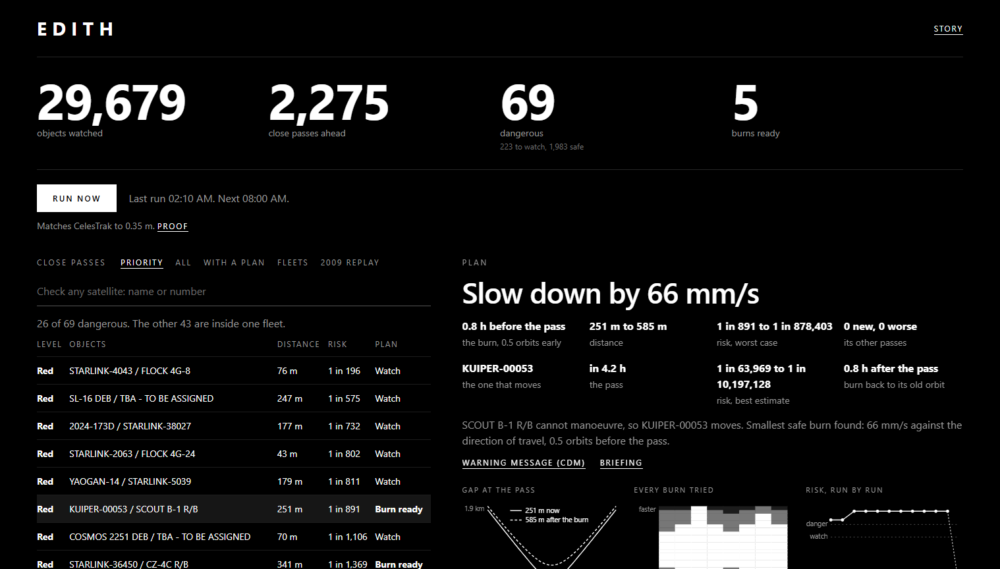
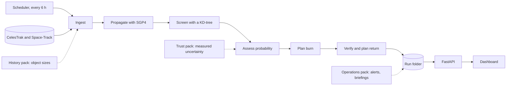
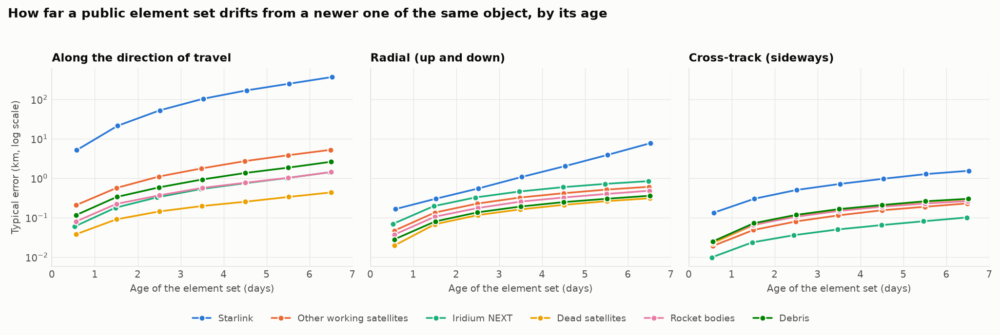
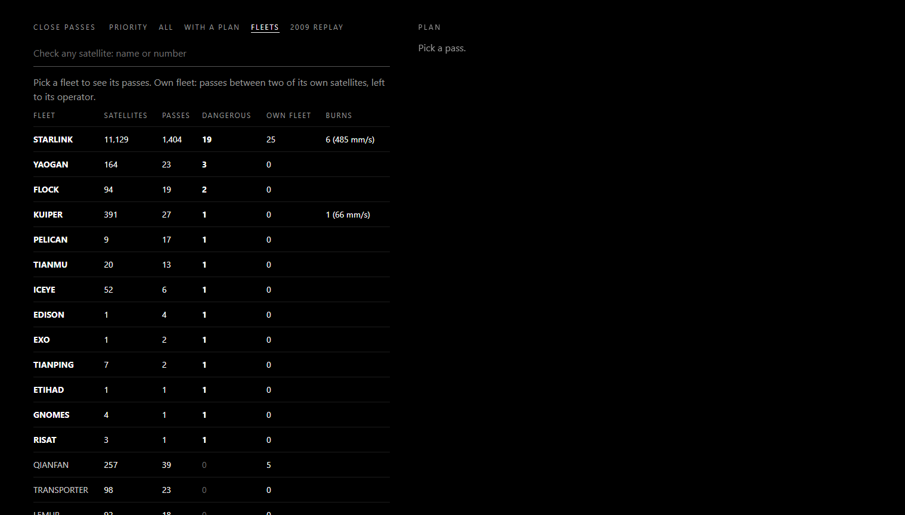
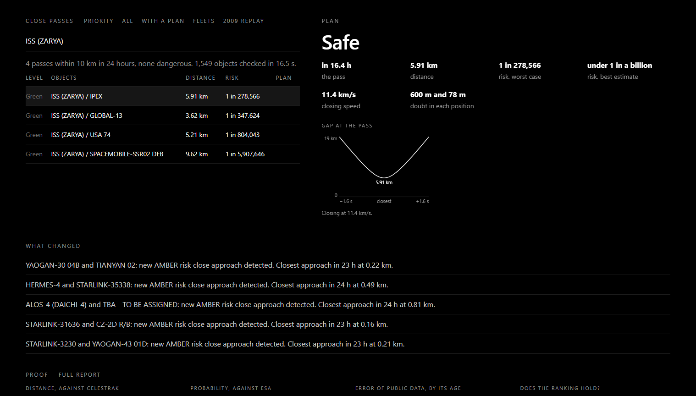

# EDITH

**Autonomous collision avoidance for low Earth orbit, built on public orbit data.**

[](https://github.com/Atharvchaskar008/EDITH/actions/workflows/tests.yml)


EDITH screens every publicly tracked object in low Earth orbit against every other, ranks the close passes by collision probability, and recommends the smallest avoidance burn that makes a dangerous pass safe. It re-runs every six hours without supervision and serves its results through a web API and an operator dashboard.

The Python package is named `fusion`.



## Contents

- [What it does](#what-it-does)
- [Results](#results)
- [How it works](#how-it-works)
- [Validation](#validation)
- [Quick start](#quick-start)
- [Usage](#usage)
- [Configuration](#configuration)
- [Repository layout](#repository-layout)
- [Add-on packs](#add-on-packs)
- [Limitations](#limitations)
- [Status](#status)
- [Data sources and acknowledgements](#data-sources-and-acknowledgements)

## What it does

- **Predicts** every close pass between tracked objects for the next 24 to 72 hours.
- **Ranks** each pass by collision probability and by the worst case over the unknown uncertainty, and labels it red, amber or green.
- **Recommends** an avoidance burn for dangerous passes: which object moves, when, in which direction and by how much.
- **Verifies** that the burn creates no new dangerous pass and worsens none the satellite already had, and plans a return burn to restore the original orbit.
- **Answers on request**: a burn plan for any pass the run did not plan, the close passes of any satellite found by name or number, and a summary per fleet.
- **Reports** what changed since the previous run, with a one-page briefing and a standard-format warning message (CDM) for each dangerous pass.
- **Checks itself** against CelesTrak's published conjunction list after every run.

## Results

Measured on a 12-core laptop on 9 October 2026, on live data, in the run of 12:10 UTC. The numbers change with every run.

| Measure | Value |
|---|---|
| Objects screened | 29,688 |
| Pairs considered | about 440 million |
| Close passes within 1 km, next 24 hours | 1,756 |
| Risk levels | 35 red, 183 amber, 1,538 green |
| Burns planned, all verified free of new dangerous passes | 5 |
| Full run, 24-hour window, orbit data cached | about 3.5 minutes |
| Full-sky search only, 72-hour window | about 7 minutes |

Example recommendation from that run: KUIPER-00053 and a spent rocket stage were predicted to pass 251 m apart at 13.2 km/s. EDITH proposed a 43 mm/s burn against the direction of travel 6.5 orbits earlier, which moves the pass to 2.66 km and lowers the worst-case probability from 1 in 900 to 1 in 500,000.

## How it works



| Stage | Method | Code |
|---|---|---|
| Ingest | Merge CelesTrak groups with the Space-Track catalogue; drop element sets older than 14 days and objects that never come below 2,000 km | `fusion/core/ingest.py` |
| Propagate | Vectorised SGP4 on a 10-second grid | `fusion/core/propagate.py` |
| Screen | KD-tree neighbour search at each step, a straight-line filter, then exact closest approach; time blocks run in parallel processes | `fusion/core/screen.py` |
| Assess | Two-dimensional probability in the encounter plane, plus the maximum over every scaling of the covariance | `fusion/risk/pc.py` |
| Plan | Grid over burn time (0.5 to 8 orbits early) and along-track size (1 to 100 mm/s); the smallest burn meeting the safety targets | `fusion/maneuver/planner.py` |
| Verify | The burned orbit is screened against the whole catalogue for 24 hours, and every dangerous pass found is compared with the same pass without the burn; a return burn restores the orbit | `fusion/maneuver/verify.py` |

The design and its reasons are in [docs/ARCHITECTURE.md](docs/ARCHITECTURE.md).

## Validation

| Check | Result |
|---|---|
| Closest approach against CelesTrak SOCRATES, from the same element sets | 200 of 200 matched; median difference 0.35 m in distance and 0.4 ms in time |
| Probability against 20,000 real ESA warnings | No offset; median difference of 0.010 in log10 for warnings above 1e-6 |
| Worst-case probability against ESA's maximum risk | Median difference of 0.017 in log10 |
| Probability against random sampling | Within 2.0 standard errors on 9 cases of 10 to 40 million draws |
| Search against an independent dense calculation | Identical events on all 7 reference cases |
| 2009 Iridium 33 / Cosmos 2251 collision, from data public one day earlier | Ranked first of Iridium 33's passes, predicted for 16:55:59 UTC against a reported 16:56, rated amber |

Public orbit data carries no uncertainty, so it was measured from 325,558 pairs of element sets of 768 objects:

| Kind of object | Along-track error after 1 day | After 3 days |
|---|---|---|
| Dead satellites | 0.06 km | 0.17 km |
| Rocket bodies | 0.15 km | 0.47 km |
| Debris | 0.22 km | 0.75 km |
| Working satellites other than Starlink | 0.37 km | 1.44 km |
| Starlink | 12 km | 77 km |



The full report, with its limits, is in [addons/b_trust/out/VALIDATION_REPORT.md](addons/b_trust/out/VALIDATION_REPORT.md).

## Quick start

Tested on Python 3.14 and Windows 11. Other versions and platforms are untested.

```
git clone https://github.com/Atharvchaskar008/EDITH.git
cd EDITH
python -m venv .venv
.venv\Scripts\python -m pip install -r requirements.txt
.venv\Scripts\python -m pip install -r requirements-addons.txt
copy .env.example .env
```

Put a free [Space-Track](https://www.space-track.org) login in `.env` to get the full catalogue, including all debris. Without it the system runs on CelesTrak data only, with partial debris coverage.

```
.venv\Scripts\python -m pytest -q
.venv\Scripts\python -m uvicorn fusion.api.main:app --port 8000
```

Then open http://localhost:8000 and press **Run now**.

## Usage

### Commands

| Purpose | Command |
|---|---|
| Start the server, dashboard and scheduler | `.venv\Scripts\python -m uvicorn fusion.api.main:app --port 8000` |
| One run from the terminal | `.venv\Scripts\python -m fusion.pipeline --quick` |
| Build the 2009 replay | `.venv\Scripts\python -m fusion.replay.replay_2009` |
| Compare the latest run with CelesTrak | `.venv\Scripts\python -m fusion.validation` |
| Run the tests | `.venv\Scripts\python -m pytest -q` |
| Measure the compiled libraries against plain Python | `.venv\Scripts\python scripts\why_python.py` |

`fusion.pipeline` accepts `--quick` (24-hour window), `--hours H`, `--mode ALL_LEO` or `--mode PRIMARIES`, and `--synthetic` (adds one clearly labelled test object).

### Web interface

| Address | Content |
|---|---|
| http://localhost:8000 | Operator dashboard: headline numbers, ranked passes, burn plans with pictures, a plan on request, a check of any satellite, fleets, alerts, 2009 replay |
| http://localhost:8000/landing | Story page for visitors |
| http://localhost:8000/docs | Interactive API documentation |

The dashboard opens on **Priority**: the dangerous passes that are not between two satellites of one fleet. **Plan now** searches for a burn for any pass the run did not plan, in about 20 seconds.

| Fleets | Check any satellite |
|---|---|
|  |  |

### API

| Route | Returns |
|---|---|
| `POST /run` | Starts a run |
| `GET /run/{id}/status` | Stage, progress and log of a run |
| `GET /latest` | Summary of the latest finished run |
| `GET /events` | Close passes, most dangerous first; filter by `level`, `plan`, `fleet` or `own_fleet` |
| `GET /events/{id}` | One pass with its plan, both tracks and the encounter-plane picture |
| `GET /events/{id}/plan` | The decision for one pass |
| `POST /events/{id}/plan` | Search now for a burn for a pass the run did not plan |
| `GET /objects/search?q=` | Find any tracked object by name or catalogue number |
| `GET /objects/{id}/passes` | Check one object now: its close passes in the next 24 hours |
| `GET /fleets` | One row per fleet: passes, dangerous passes to act on, burns planned |
| `GET /alerts` | Changes since the previous run |
| `GET /validation` | The comparison with CelesTrak |
| `GET /replay/2009` | The 2009 replay |

The full reference is in [docs/API.md](docs/API.md).

## Configuration

Every setting is in `fusion/config.py`. The ones most often changed:

| Setting | Default | Meaning |
|---|---|---|
| `SCREEN_MODE` | `ALL_LEO` | Full sky, or `PRIMARIES` for a protected set only |
| `WINDOW_HOURS`, `QUICK_WINDOW_HOURS` | 72, 24 | Look-ahead windows |
| `SCREEN_THRESHOLD_ALL_LEO_KM` | 1 | Largest miss distance reported in full-sky mode |
| `RED_PC_MAX`, `AMBER_PC_MAX` | 1e-4, 1e-5 | Risk levels, on worst-case probability |
| `TARGET_PC_AFTER`, `TARGET_PC_MAX_AFTER` | 1e-6, 1e-5 | What a burn must achieve |
| `MAX_PLANS_PER_RUN` | 5 | Burn searches per run |
| `SCHEDULER_INTERVAL_HOURS` | 6 | Time between automatic runs (each looks 24 hours ahead) |

Environment variables: `FUSION_SCHEDULER=0` disables the automatic runs; `FUSION_RUNS_DIR` moves the runs folder. Operating details are in [docs/OPERATIONS.md](docs/OPERATIONS.md).

## Repository layout

```
fusion/                 The engine and the server
  core/                 Ingest, propagation, screening, exact closest approach
  risk/                 Uncertainty and collision probability
  maneuver/             Burn planner, burned-orbit model, safety re-screen
  monitor/              Six-hour scheduler
  replay/               2009 collision replay
  api/                  FastAPI application and the dashboard page
  pipeline.py           Runs every stage and writes the run folder
  validation.py         Comparison with CelesTrak SOCRATES
  addons.py             Hooks into the optional packs
  config.py             All settings
  contracts.py          Data models
addons/
  a_history/            Object sizes, 2009 replay data, reference test cases
  b_trust/              Measured uncertainty and independent validation
  c_ops/                Alerts, briefings, CDM export, risk-trend model
landing/                Story page served at /landing
tests/                  Test suite for the main system
scripts/                Benchmarks and fixture builder
data/fixtures/          Small sample files used by tests
docs/                   Architecture, API reference, operations guide
```

`data/runs/` and `data/cache/` are created at run time and are not in version control.

## Add-on packs

The main system is complete without them; each pack adds a capability through a hook with a built-in fallback.

| Pack | Adds | Without it |
|---|---|---|
| `addons/a_history` | Measured radar sizes for 11,063 objects; the 2009 replay data | Size class from Space-Track; no replay |
| `addons/b_trust` | Measured position uncertainty; validation against ESA and CelesTrak | An assumed uncertainty table; no validation report |
| `addons/c_ops` | Alerts between runs, pass history, briefings, CDM export, a risk-trend model trained on 162,634 ESA warnings | Results without change tracking |

## Limitations

- **Public data is coarse.** For satellites that manoeuvre, a prediction one day ahead is off by kilometres. EDITH therefore lists passes between two satellites of the same fleet without proposing a burn.
- **The measured uncertainty understates the true error.** It compares public element sets with each other, not with true positions. This is why ranking uses the worst case.
- **Objects smaller than about 10 cm are not in any public catalogue.**
- **Object size is approximate**: a radar size where one is published, a size class otherwise.
- **Beyond one day, passes inside a fleet are not predictions.** A full-sky run over 72 hours found about 1,150 passes a day outside fleets on each of the three days, while passes between two satellites of one fleet grew from 862 on the first day to 9,209 on the third: the error in public data scrambles the spacing that fleets keep. The scheduled run therefore looks 24 hours ahead.
- **Some passes get no burn.** Two objects in similar orbits can meet once every lap; an along-track burn that clears one meeting moves the danger to the next. EDITH detects this and says so instead of proposing the burn.
- **Burns are treated as instantaneous**, and the safety re-screen covers 24 hours.
- **At most five burn searches per run**, to keep a run to minutes. It is a setting, and a burn for any other pass can be requested afterwards.
- **Pairs drifting together at under 0.1 km/s are not assessed**; the short-encounter probability method does not apply to them.
- **This is decision support, not an operational system.** It does not command spacecraft.

## Status

| Area | State |
|---|---|
| Engine, pipeline, scheduler, API | Complete; 118 tests, run on GitHub on every push |
| Validation pack | Complete; 54 tests |
| Dashboard | Working: numbers, ranked list, plans with three pictures, plan on request, satellite check, fleets, alerts, replay. A 3D view is not built |

## Data sources and acknowledgements

- Orbit data: [CelesTrak](https://celestrak.org) and [Space-Track](https://www.space-track.org).
- Conjunction list used for validation: CelesTrak SOCRATES.
- Real warning messages: the ESA Collision Avoidance Challenge dataset, [Zenodo record 4463683](https://zenodo.org/records/4463683).
- Libraries: `sgp4`, NumPy, SciPy, Pydantic, FastAPI, APScheduler, LightGBM.

Built by Team Fusion for a 2026 hackathon. No licence has been chosen yet; until a licence file is added, all rights are reserved by the authors.
