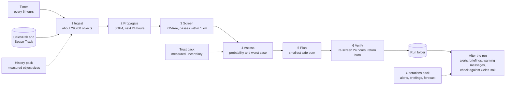
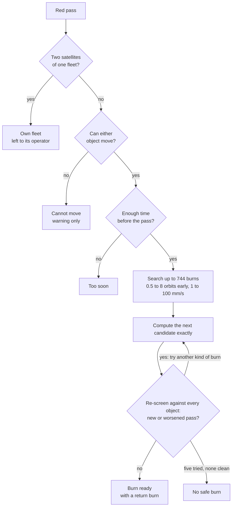
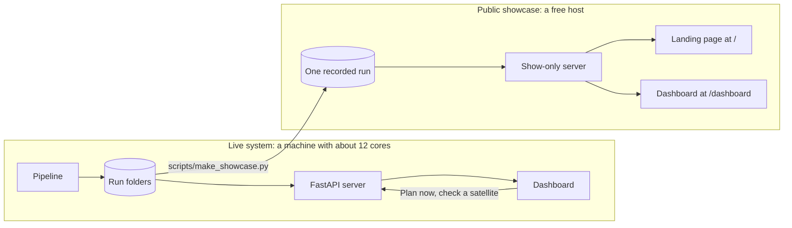

# EDITH

**Autonomous collision avoidance for low Earth orbit, built on public orbit data.**

[](https://github.com/Atharvchaskar008/EDITH/actions/workflows/tests.yml)


EDITH screens every publicly tracked object in low Earth orbit against every other, ranks the close passes by collision probability, and recommends the smallest avoidance burn that makes a dangerous pass safe. It re-runs every six hours without supervision and serves its results through a web API and an operator dashboard.

**Public showcase: https://edith-guhk.onrender.com** opens on the landing page, whose button leads to the dashboard. It shows a recorded run and starts no work of its own; the host sleeps when idle, so the first visit can take a minute.

The Python package is named `fusion`.


## Contents

- [What it does](#what-it-does)
- [Results](#results)
- [How it works](#how-it-works) (and [why these tools](#why-these-tools))
- [Validation](#validation)
- [Quick start](#quick-start)
- [Usage](#usage)
- [Configuration](#configuration)
- [Repository layout](#repository-layout)
- [Add-on packs](#add-on-packs)
- [Limitations](#limitations)
- [Status](#status)
- [Data sources and acknowledgements](#data-sources-and-acknowledgements)

## What it does

- **Predicts** every close pass between tracked objects for the next 24 to 72 hours.
- **Ranks** each pass by collision probability and by the worst case over the unknown uncertainty, and labels it red, amber or green.
- **Recommends** an avoidance burn for dangerous passes: which object moves, when, in which direction and by how much.
- **Verifies** that the burn creates no new dangerous pass and worsens none the satellite already had, and plans a return burn to restore the original orbit.
- **Answers on request**: what a burn would take for a pass the system only watches, the close passes of any satellite found by name or number, and a summary per fleet.
- **Reports** what changed since the previous run, with a one-page briefing and a standard-format warning message (CDM) for each dangerous pass.
- **Checks itself** against CelesTrak's published conjunction list after every run.

## Results

Measured on a 12-core laptop on 9 October 2026, on live data, in the run of 21:18 UTC. The numbers change with every run.

| Measure | Value |
|---|---|
| Objects screened | 29,679 |
| Pairs considered | about 440 million |
| Close passes within 1 km, next 24 hours | 2,332 |
| Risk levels | 69 red, 235 amber, 2,028 green |
| Red passes between two satellites of one fleet, left to its operator | 45 |
| Burns ready, each verified to create no dangerous pass and worsen none | 17 |
| Red passes with a stated reason for no burn | 7: no safe burn 4, neither object can move 2, too soon 1 |
| Full run, 24-hour window, orbit data cached | 6 min 45 s, of which the search is under 2 minutes and the 21 burn searches under 4 |

Example recommendation from that run: STARLINK-4043 and FLOCK 4G-8 were predicted to pass 76 m apart at 12.7 km/s. EDITH proposed that the Starlink slow down by 66 mm/s half an orbit before the pass, which moves the pass to 451 m and lowers the worst-case probability from 1 in 196 to 1 in 737,000.

A burn is advice. Red means worth an operator's attention on the worst case; the burn is ready in case better tracking confirms the risk.

## How it works

### One run

Every six hours a run takes the whole of low Earth orbit through six stages and writes one folder of results.



### What happens to a red pass

A pass is red when its worst-case probability is 1 in 10,000 or more. Each one ends as a burn that is ready, or with the reason there is none.



### How it is served

The live system does the work. The public site is a small show-only server over one recorded run.



| Stage | Method | Code |
|---|---|---|
| Ingest | Merge CelesTrak groups with the Space-Track catalogue; drop element sets older than 14 days and objects that never come below 2,000 km | `fusion/core/ingest.py` |
| Propagate | Vectorised SGP4 on a 10-second grid | `fusion/core/propagate.py` |
| Screen | KD-tree neighbour search at each step, a straight-line filter, then exact closest approach; time blocks run in parallel processes | `fusion/core/screen.py` |
| Assess | Two-dimensional probability in the encounter plane, plus the maximum over every scaling of the covariance | `fusion/risk/pc.py` |
| Plan | For every red pass where a burn is possible: a grid over burn time (0.5 to 8 orbits early) and along-track size (1 to 100 mm/s); the smallest burn meeting the safety targets | `fusion/maneuver/planner.py` |
| Verify | The burned orbit is screened against the whole catalogue for 24 hours, and every dangerous pass found is compared with the same pass without the burn; a return burn restores the orbit | `fusion/maneuver/verify.py` |

The design and its reasons are in [docs/ARCHITECTURE.md](docs/ARCHITECTURE.md).

### Why these tools

Python gives the orders; the heavy work runs in compiled C and C++ libraries. Measured on the same laptop with `scripts/why_python.py`:

| Choice | Measured | Against |
|---|---|---|
| `sgp4` (compiled C++) through NumPy arrays | 1.5 million positions a second on one core | 18 times the same maths in plain Python |
| SciPy KD-tree for the neighbour search | 40 ms to find the nearby pairs among 30,000 objects | 60 s to check every pair with NumPy, for the identical answer |
| The two together, one day of the whole sky on one core | 6 minutes | 145 hours checking every pair |
| Processes, one per 30-minute time block | 7 minutes on eleven cores for a 72-hour search | 32 minutes on one core |

The choice of method matters far more than the choice of language: the slow parts are already compiled, and a rewrite of the thin layer above them would gain little. SGP4 is used because public element sets are fitted with it and only give correct positions when read back with it. No machine-learning model is used for the physics, which has exact formulas; one optional model forecasts how a pass's risk will change.

## Validation

| Check | Result |
|---|---|
| Closest approach against CelesTrak SOCRATES, from the same element sets | 200 of 200 matched; median difference 0.35 m in distance and 0.4 ms in time |
| Probability against 20,000 real ESA warnings | No offset; median difference of 0.010 in log10 for warnings above 1e-6 |
| Worst-case probability against ESA's maximum risk | Median difference of 0.017 in log10 |
| Probability against random sampling | Within 2.0 standard errors on 9 cases of 10 to 40 million draws |
| Search against an independent dense calculation | Identical events on all 7 reference cases |
| 2009 Iridium 33 / Cosmos 2251 collision, from data public one day earlier | Ranked first of Iridium 33's passes, predicted for 16:55:59 UTC against a reported 16:56, rated amber |

Public orbit data carries no uncertainty, so it was measured from 325,558 pairs of element sets of 768 objects:

| Kind of object | Along-track error after 1 day | After 3 days |
|---|---|---|
| Dead satellites | 0.06 km | 0.17 km |
| Rocket bodies | 0.15 km | 0.47 km |
| Debris | 0.22 km | 0.75 km |
| Working satellites other than Starlink | 0.37 km | 1.44 km |
| Starlink | 12 km | 77 km |


The full report, with its limits, is in [addons/b_trust/out/VALIDATION_REPORT.md](addons/b_trust/out/VALIDATION_REPORT.md).

## Tech stack

| Layer | Technologies | Role |
|---|---|---|
| **Astrodynamics & Math** | Python 3.11–3.14, `sgp4` (C++ extension), NumPy, SciPy | Orbit propagation, vectorised math, KD-tree spatial screening |
| **Backend API & Scheduling** | FastAPI, Uvicorn, Pydantic v2, APScheduler, Requests, HTTPX | REST API, background scheduler (6-hour intervals), automated runs |
| **Risk Modeling & ML** | LightGBM, scikit-learn, Pandas, Joblib, Matplotlib | Conjunction risk-trend prediction model and validation analysis |
| **Operator Dashboard** | Vanilla JavaScript, HTML5, CSS (Glassmorphism), SVG charts | Conjunction screening, burn recommendations, fleet views, satellite checks |
| **Interactive 3D Landing Page** | Node.js, Nuxt, Three.js, WebGL | 3D interactive Earth globe, orbital paths, visitor showcase |

---

## Quick start

EDITH is supported on **macOS**, **Linux**, and **Windows** (Python 3.11 through 3.14).

### Prerequisites

- **Python 3.11+** (Python 3.13 or 3.14 recommended)
- **Node.js 18+** (required to run the standalone 3D interactive landing page)
- **macOS only**: Install OpenMP runtime for `lightgbm`:
  ```bash
  brew install libomp
  ```

### Installation

#### macOS / Linux
```bash
git clone https://github.com/Atharvchaskar008/EDITH.git
cd EDITH

# Create and activate virtual environment
python3 -m venv .venv
source .venv/bin/activate

# Install dependencies
pip install --upgrade pip
pip install -r requirements.txt
pip install -r requirements-addons.txt

# Configure environment
cp .env.example .env
```

#### Windows
```cmd
git clone https://github.com/Atharvchaskar008/EDITH.git
cd EDITH

# Create virtual environment
python -m venv .venv
.venv\Scripts\python -m pip install --upgrade pip
.venv\Scripts\python -m pip install -r requirements.txt
.venv\Scripts\python -m pip install -r requirements-addons.txt

# Configure environment
copy .env.example .env
```

> [!NOTE]
> Put a free [Space-Track](https://www.space-track.org) login in `.env` (`SPACETRACK_USER` and `SPACETRACK_PASSWORD`) to fetch the complete catalogue, including all debris. Without it, EDITH runs on public CelesTrak data with partial debris coverage.
>
> **CelesTrak rate-limiting:** CelesTrak updates element sets every 2 hours and temporarily rate-limits duplicate downloads of the same group. Cached files in `data/cache/` prevent repeated downloads.

### Verification & Launch

Run the test suite to verify installation:
```bash
# macOS / Linux
.venv/bin/pytest -q

# Windows
.venv\Scripts\python -m pytest -q
```

Build the historical 2009 collision replay dataset (prepopulates conjunctions and maneuver plans without querying live APIs):
```bash
# macOS / Linux
.venv/bin/python -m fusion.replay.replay_2009

# Windows
.venv\Scripts\python -m fusion.replay.replay_2009
```

Start the FastAPI backend and Operator Dashboard:
```bash
# macOS / Linux
.venv/bin/python -m uvicorn fusion.api.main:app --port 8000

# Windows
.venv\Scripts\python -m uvicorn fusion.api.main:app --port 8000
```

Open **http://localhost:8000** in your browser.

To launch the dedicated **3D Interactive Landing Page** (optional):
```bash
node landing/server.js
```
Open **http://localhost:3000** in your browser.

---

## Usage

### Commands

| Purpose | macOS / Linux | Windows |
|---|---|---|
| **Start server, dashboard & scheduler** | `.venv/bin/python -m uvicorn fusion.api.main:app --port 8000` | `.venv\Scripts\python -m uvicorn fusion.api.main:app --port 8000` |
| **Start 3D landing page server** | `node landing/server.js` | `node landing\server.js` |
| **Single run (24h window, full sky)** | `.venv/bin/python -m fusion.pipeline --quick` | `.venv\Scripts\python -m fusion.pipeline --quick` |
| **Single run (fast, protected primaries only)** | `.venv/bin/python -m fusion.pipeline --quick --mode PRIMARIES` | `.venv\Scripts\python -m fusion.pipeline --quick --mode PRIMARIES` |
| **Build the 2009 replay** | `.venv/bin/python -m fusion.replay.replay_2009` | `.venv\Scripts\python -m fusion.replay.replay_2009` |
| **Compare latest run with CelesTrak** | `.venv/bin/python -m fusion.validation` | `.venv\Scripts\python -m fusion.validation` |
| **Run the tests** | `.venv/bin/pytest -q` | `.venv\Scripts\python -m pytest -q` |
| **Benchmark compiled libs vs plain Python** | `.venv/bin/python scripts/why_python.py` | `.venv\Scripts\python scripts\why_python.py` |
| **Check a running server end to end** | `.venv/bin/python scripts/check_server.py` | `.venv\Scripts\python scripts\check_server.py` |

`fusion.pipeline` options:
- `--quick`: 24-hour look-ahead window (instead of 72 hours).
- `--mode {ALL_LEO,PRIMARIES}`: `ALL_LEO` checks all tracked objects; `PRIMARIES` screens protected satellites against the catalogue.
- `--hours H`: Custom prediction horizon in hours.
- `--synthetic`: Injects a clearly marked test conjunction.

### Web interfaces

| Address | Description |
|---|---|
| **http://localhost:8000** | **Operator Dashboard**: Conjunction metrics, priority passes, burn recommendations, what-if planning, single satellite search/pass checker, fleet views, alerts, and 2009 replay |
| **http://localhost:3000** | **3D Interactive Landing Page**: WebGL Three.js interactive Earth globe with orbital paths, visual impact analysis, and mission brief |
| **http://localhost:8000/landing** | Sends the visitor on to the landing page (port 3000 locally) |
| **http://localhost:8000/docs** | Interactive OpenAPI / Swagger documentation |

The dashboard opens on **Priority**: dangerous passes outside a single operator's fleet. Every row displays **Burn ready** or explains why no burn is proposed. For watched passes, clicking **Plan now** computes a what-if avoidance burn in ~20 seconds.

| Fleets | Check any satellite |
|---|---|
|  |  |

### API Routes

| Route | Method | Description |
|---|---|---|
| `/run` | `POST` | Trigger a new conjunction screening run |
| `/run/{id}/status` | `GET` | Stage, progress percentage, and log messages of a run |
| `/latest` | `GET` | Summary of the most recent completed run |
| `/events` | `GET` | Ranked close passes; filter by `level`, `plan`, `fleet`, or `own_fleet` |
| `/events/{id}` | `GET` | Pass details: burn plan, trajectory coordinates, encounter-plane geometry |
| `/events/{id}/plan` | `GET` / `POST` | Read or compute an on-demand avoidance burn plan |
| `/objects/search?q=` | `GET` | Find any tracked object by name or NORAD catalog number |
| `/objects/{id}/passes` | `GET` | Screen one object on-demand against all nearby catalog objects |
| `/fleets` | `GET` | Overview aggregated by satellite constellation / fleet |
| `/alerts` | `GET` | Critical and warning changes since the previous run |
| `/validation` | `GET` | Validation comparison against CelesTrak SOCRATES |
| `/proof` | `GET` | Validation data assembled for the dashboard's proof view |
| `/replay/2009` | `GET` | Historical 2009 Iridium 33 / Cosmos 2251 collision scenario |

The full reference is in [docs/API.md](docs/API.md).

## Configuration

Every setting is in `fusion/config.py`. The ones most often changed:

| Setting | Default | Meaning |
|---|---|---|
| `SCREEN_MODE` | `ALL_LEO` | Full sky, or `PRIMARIES` for a protected set only |
| `WINDOW_HOURS`, `QUICK_WINDOW_HOURS` | 72, 24 | Look-ahead windows |
| `SCREEN_THRESHOLD_ALL_LEO_KM` | 1 | Largest miss distance reported in full-sky mode |
| `RED_PC_MAX`, `AMBER_PC_MAX` | 1e-4, 1e-5 | Risk levels, on worst-case probability |
| `TARGET_PC_AFTER`, `TARGET_PC_MAX_AFTER` | 1e-6, 1e-5 | What a burn must achieve |
| `MAX_PLANS_PER_RUN` | 40 | Ceiling on burn searches per run; a 24-hour run needs about 20 |
| `SCHEDULER_INTERVAL_HOURS` | 6 | Time between automatic runs (each looks 24 hours ahead) |

Environment variables: `FUSION_SCHEDULER=0` disables the automatic runs; `FUSION_RUNS_DIR` moves the runs folder; `FUSION_READ_ONLY=1` makes the server show-only for a small public host: it opens on the landing page, with the dashboard at `/dashboard` (see [docs/OPERATIONS.md](docs/OPERATIONS.md#public-showcase)). Operating details are in [docs/OPERATIONS.md](docs/OPERATIONS.md).

## Repository layout

```
fusion/                     The engine and the server (the Python package)
  config.py                 Every setting and path
  contracts.py              Data models for objects, events, plans and alerts
  core/                     Ingest, propagation, screening, exact closest approach
  risk/                     Uncertainty and collision probability
  maneuver/                 Burn planner, burned-orbit model, safety re-screen
  pipeline.py               Runs every stage and writes the run folder
  monitor/                  Six-hour scheduler
  replay/                   2009 collision replay
  validation.py             Comparison with CelesTrak SOCRATES
  addons.py                 Hooks into the optional packs, each with a fallback
  api/
    main.py                 FastAPI application: every route
    static/                 The dashboard: index.html, dashboard.css, dashboard.js
addons/                     Optional packs, each standalone with its own tests
  a_history/                Object sizes, 2009 replay data, reference test cases
  b_trust/                  Measured uncertainty and independent validation
  c_ops/                    Alerts, briefings, CDM export, risk-trend model
landing/                    Story page and standalone 3D interactive WebGL visualization server
tests/                      Test suite for the main system
scripts/                    Benchmarks, an end-to-end check of a running server, the showcase recorder
deploy/showcase/            One recorded run, the 2009 replay and the CelesTrak comparison, for the public host
render.yaml                 The public host's settings: a show-only server over deploy/showcase/
docs/
  ARCHITECTURE.md           Components, data flow and design decisions
  API.md                    Every route and data shape
  OPERATIONS.md             Commands, timings, settings and limits
  images/                   Pictures used in this file
  team/                     Explainers and the demo script
.github/workflows/          Tests on GitHub, on Python 3.11 to 3.14
pyproject.toml              Package metadata and test settings
requirements.txt            Libraries of the main system
requirements-addons.txt     Libraries the packs need
CONTRIBUTING.md             Set-up, conventions and where each kind of change goes
```

`data/` is created at run time (`data/runs/` and `data/cache/`) and is not in version control.

## Add-on packs

The main system is complete without them; each pack adds a capability through a hook with a built-in fallback.

| Pack | Adds | Without it |
|---|---|---|
| `addons/a_history` | Measured radar sizes for 11,063 objects; the 2009 replay data | Size class from Space-Track; no replay |
| `addons/b_trust` | Measured position uncertainty; validation against ESA and CelesTrak | An assumed uncertainty table; no validation report |
| `addons/c_ops` | Alerts between runs, pass history, briefings, CDM export, a risk-trend model trained on 162,634 ESA warnings | Results without change tracking |

## Limitations

- **Public data is coarse.** For satellites that manoeuvre, a prediction one day ahead is off by kilometres. EDITH therefore lists passes between two satellites of the same fleet without proposing a burn.
- **The measured uncertainty understates the true error.** It compares public element sets with each other, not with true positions. This is why ranking uses the worst case.
- **Objects smaller than about 10 cm are not in any public catalogue.**
- **Object size is approximate**: a radar size where one is published, a size class otherwise.
- **Beyond one day, passes inside a fleet are not predictions.** A full-sky run over 72 hours found about 1,150 passes a day outside fleets on each of the three days, while passes between two satellites of one fleet grew from 862 on the first day to 9,209 on the third: the error in public data scrambles the spacing that fleets keep. The scheduled run therefore looks 24 hours ahead.
- **Some passes get no burn.** Two objects in similar orbits can meet once every lap; an along-track burn that clears one meeting moves the danger to the next. EDITH detects this and says so instead of proposing the burn.
- **Burns are treated as instantaneous**, and the safety re-screen covers 24 hours.
- **Some burns stop short of the target.** The search goes up to 100 mm/s. In the latest run 6 of the 17 burns brought the worst case back to green but left the best-estimate probability just above 1 in a million; each says it is the best available.
- **Pairs drifting together at under 0.1 km/s are not assessed**; the short-encounter probability method does not apply to them.
- **This is decision support, not an operational system.** It does not command spacecraft.

## Status

| Area | State |
|---|---|
| Engine, pipeline, scheduler, API | Complete; 123 tests, run on GitHub on every push |
| Validation pack | Complete; 54 tests |
| Operator Dashboard | Working: conjunction metrics, ranked passes, burn plans with SVG geometry, what-if burns on request, satellite pass lookup, fleet aggregations, alerts, and 2009 replay |
| 3D Interactive Landing Page | Working: WebGL Three.js interactive Earth globe with orbital tracks, visitor mission walkthrough, and audio effects at http://localhost:3000 |

## Data sources and acknowledgements

- Orbit data: [CelesTrak](https://celestrak.org) and [Space-Track](https://www.space-track.org).
- Conjunction list used for validation: CelesTrak SOCRATES.
- Real warning messages: the ESA Collision Avoidance Challenge dataset, [Zenodo record 4463683](https://zenodo.org/records/4463683).
- Libraries: `sgp4`, NumPy, SciPy, Pydantic, FastAPI, APScheduler, LightGBM.

Built by Team Fusion for a 2026 hackathon. No licence has been chosen yet; until a licence file is added, all rights are reserved by the authors.
